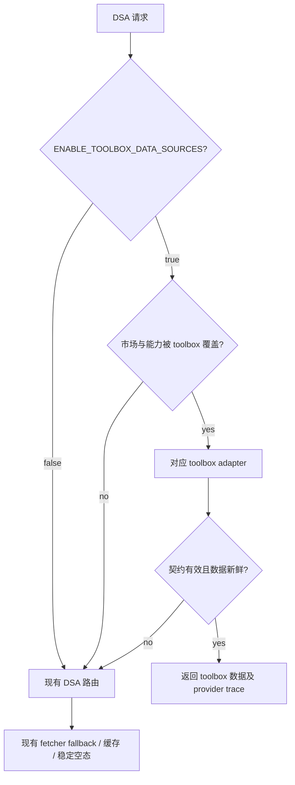

# 架构、路由与数据契约

## 接入点

DSA 已通过 `DataFetcherManager` 聚合大多数行情、日线、实时行情、基本面、市场统计与板块能力。集成应新增两个 adapter，而不是改写业务服务：

```text
data_provider/
  astock_toolbox_fetcher.py
  global_stock_toolbox_fetcher.py
  base.py                         # 注册、优先路由与 fallback 编排
```

adapter 从 `third_party/` 动态定位 toolbox 实现，并把数据标准化到 DSA 已有模型。业务层继续只依赖 `DataFetcherManager`。

## 路由矩阵

| 能力 | A 股 toolbox | 全球 toolbox | DSA fallback |
| --- | --- | --- | --- |
| 实时行情 / 指数 | 腾讯、通达信路径 | 新浪、腾讯、东财路径 | 现有 realtime priority |
| 日/周/月/分钟 K 线 | 通达信优先，腾讯等备胎 | 新浪 / Yahoo | 现有 daily routing |
| 五档盘口、逐笔成交 | 通达信 | 不在首期范围 | 原能力或明确 not-supported |
| 基本面、财务三表、F10 | 通达信 / 新浪 / 东财 | 东财 / Yahoo / SEC | 现有 fundamental adapters |
| 新闻、公告、研报 | 东财 / 巨潮等 | Yahoo / SEC 等 | 现有新闻与搜索链路 |
| 资金流、行业、概念、龙虎榜 | 东财等 | 东财 / FINRA / SEC（按市场） | 现有 market/screening provider |
| 筹码分布 | 本地 OHLC + 换手率推演 | 不适用 | AkShare/Tushare 现有口径 |

## 运行语义



不把 toolbox 成功结果再用旧源“补全”字段，除非某项字段有显式的字段级 fallback 规则。否则同一响应会混入不同时间点或不同口径的数据。

## 必须保留的 DSA 行为

- 既有 API、CLI、Web、桌面端和报告字段保持兼容。
- provider trace、熔断、缓存 TTL、超时和诊断仍由 DSA 管理。
- 日股、韩股、台股继续原路由；Futu/Longbridge 账户与授权能力不被覆盖。
- toolbox 缺失、链接失效、函数不存在或上游响应变化时，必须 fail-open 到已有链路，而不是中断整次分析。

## 数据契约风险

### 筹码分布

`a-stock-data` 使用 OHLC 与换手率推演筹码；DSA 的 AkShare/Tushare 实现可能使用不同来源或时间窗。返回结果必须增加或保留 `source`、`method`、`as_of`，并禁止把两者缓存到相同无版本 key。

### K 线与复权

通达信 K 线通常为不复权数据。adapter 必须明确 `adjustment`，并在需要跨除权日的分析前应用受支持的复权策略；不得把不复权数据伪装成既有前复权序列。

### 实时数据

实时行情必须保留报价时间、市场状态、来源和 stale 标记。旧北交所代码、停牌或非交易时段的“静止报价”不能被当成有效实时价。

### 使用条款

两个 toolbox 包含公开 HTTP 数据源；其中部分源只适合个人研究，或有自动化请求限制。DSA adapter 必须复用其节流、User-Agent、超时和来源标注，不得绕过上游限制。
